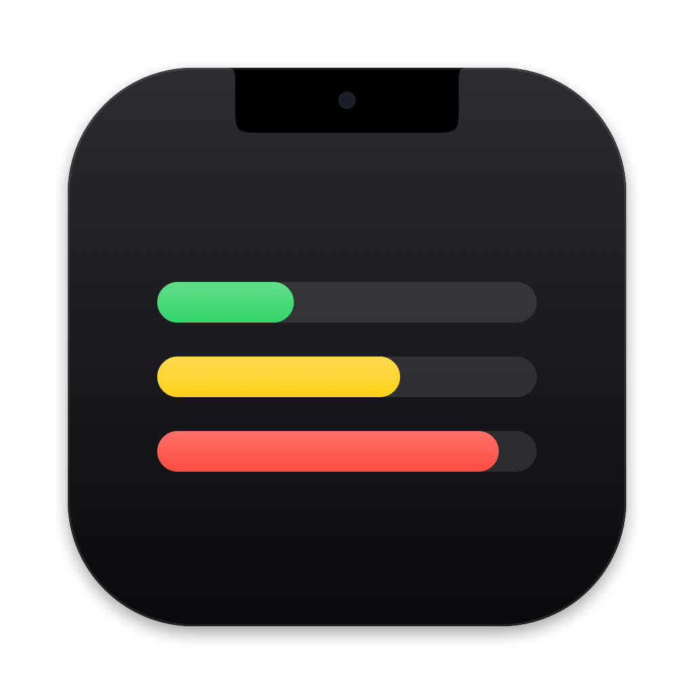
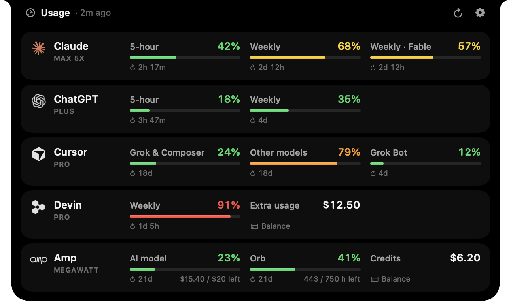

<p align="center">
  
</p>

<h1 align="center">OpenNotch</h1>

<p align="center">
  <b>Your AI usage limits, living in your MacBook's notch.</b><br>
  Claude · ChatGPT (Codex) · Cursor · Devin · Amp — read with the sessions already on your Mac. No API keys.
</p>

<p align="center">
  
</p>

## Why

If you use several AI coding tools, their limits live in five different places: a 5-hour window here, a weekly quota there, a monthly pool somewhere else. OpenNotch puts all of them in one glanceable spot — the notch — so you know which tool still has headroom before you start a long task.

## Features

- **Glanceable** — while closed, the notch shows the limit closest to running out (or a small ring for every service).
- **Hover to open** — every limit with a colour-coded bar and a reset countdown; move away to close.
- **Zero setup** — detects which tools you are signed in to and reuses their existing local sessions.
- **Fresh without effort** — refreshes every 15 minutes (5–60 configurable), instantly from the ↻ button, and right after a limit window resets.
- **Private by design** — credentials are only read at refresh time and only sent to each service's own API. Nothing is copied, stored or refreshed.
- **Native and light** — SwiftUI + AppKit, official vector logos, ~0% CPU while idle.

<p align="center">
  
  &nbsp;
  
</p>

## What it tracks

| Service | Limits shown | Session it reads |
| --- | --- | --- |
| **Claude** | 5-hour, Weekly, Weekly per model (e.g. Fable) | Claude Code — macOS Keychain item `Claude Code-credentials` (or `~/.claude/.credentials.json`) |
| **ChatGPT** | Codex limits of your plan (5-hour and/or Weekly) | Codex CLI — `~/.codex/auth.json` |
| **Cursor** | Grok & Composer pool, Other models pool, Grok Bot | Cursor app (`state.vscdb`) or the Grok Bot app |
| **Devin** | Weekly quota (plus Daily when your plan shows it), extra usage balance | Devin CLI — `~/.local/share/devin/credentials.toml`, or Devin Desktop |
| **Amp** | AI model (agent) usage, Orb hours, credits balance | Amp CLI — `~/.local/share/amp/secrets.json` |

Tools you aren't signed in to are simply hidden. Each one can also be turned off in Settings.

## Install

Requires **macOS 14 Sonoma or later** and the Swift 6 toolchain (Xcode 16 or newer). A MacBook with a notch is recommended; on other displays OpenNotch draws a small virtual notch at the top centre of the screen.

```bash
git clone https://github.com/rasitakyol/opennotch.git
cd opennotch
make install
```

`make install` builds the app, copies it to `/Applications` and launches it. Use `make run` to try it from `build/` instead. Turn on **Launch at login** in Settings to keep it around.

## Using it

- **Hover** the notch (or click it) to open the panel; move away or click elsewhere to close it.
- **↻** refreshes everything now, **⚙** opens Settings.
- **Right-click** the notch for Refresh Now, Settings and Quit.
- Hover a row and click **↗** to open that service's own usage page.
- A **⚠︎** next to a name means the latest refresh failed; the last known numbers stay visible and the tooltip tells you how to fix it.

**Settings:** refresh interval, what the closed notch shows (most critical limit / all services / notch only), open on hover, haptic feedback, launch at login, and which services to track.

## How it works

For every tool, OpenNotch reads the token that tool already keeps on your Mac and asks the same backend that powers the tool's own usage screen:

| Service | Request |
| --- | --- |
| Claude | `GET https://api.anthropic.com/api/oauth/usage` |
| ChatGPT | `GET https://chatgpt.com/backend-api/wham/usage` |
| Cursor | `POST https://api2.cursor.sh/aiserver.v1.DashboardService/GetCurrentPeriodUsage` and `…/GetSandUsageStatus` (Grok Bot) |
| Devin | `POST https://server.codeium.com/exa.seat_management_pb.SeatManagementService/GetUserStatus` |
| Amp | `POST https://ampcode.com/api/internal?userDisplayBalanceInfo` (the call behind `amp usage`) |

**Privacy notes**

- Tokens are never refreshed by OpenNotch. These tools rotate their refresh tokens, so refreshing from a second app could sign you out of the tool itself. If a session expires, OpenNotch keeps the last numbers and asks you to open that tool once.
- The Claude Code Keychain item is read through `/usr/bin/security`, the same tool Claude Code uses to write it, so no extra permission prompt appears.
- Only usage numbers and plan names are cached, in `~/Library/Application Support/OpenNotch/usage-cache.json`.
- These endpoints are undocumented and may change. If a service stops working, please open an issue.

## Troubleshooting

Print exactly what each service returns (usage numbers and error titles only, never credentials):

```bash
build/OpenNotch.app/Contents/MacOS/OpenNotch --probe
```

## Development

```bash
make test                 # parser and formatting tests
make run                  # build the .app into build/ and launch it
make probe                # run the live provider check from source
make icon                 # regenerate the app icon
swift run OpenNotch --render-docs docs/images   # regenerate README images from demo data
build/OpenNotch.app/Contents/MacOS/OpenNotch --preview   # keep the panel open while working on layout
```

```
Sources/OpenNotchCore   credential discovery, provider clients, response parsing (unit-tested, no UI)
Sources/OpenNotch       notch windows (AppKit), SwiftUI views, settings, refresh scheduling
Resources/              Info.plist, app icon, service logos (SVG)
Tests/                  parsing tests built from real (anonymised) responses
```

Adding a service means implementing `UsageProvider` (`detect()` + `fetch()`), registering it in `ProviderRegistry`, and dropping its SVG logo into `Resources/Logos`.

## Disclaimer

OpenNotch is an independent project and is not affiliated with or endorsed by Anthropic, OpenAI, Anysphere (Cursor), Cognition (Devin) or Amp. Product names and logos are trademarks of their respective owners and are used only to identify the services.

## License

[MIT](LICENSE)
